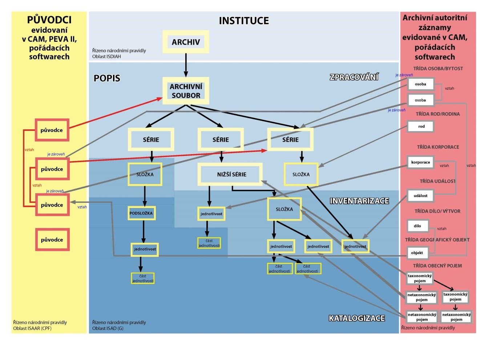

.. _zp_popisarch:

POPIS ARCHIVÁLIÍ
===================

Tato kapitola definuje úrovně archivního popisu a stanovuje jeho obecné
principy. V kapitole je určena závazná hloubka popisu pro jednotlivé
druhy archivních pomůcek.

Zásady popisu
-----------------

Tvorba archivního popisu představuje zásadní činnost pro zpřístupnění
archiválií. Při pořádání dochází k fyzickému a logickému uspořádání
archiválií podle příslušného pořádacího schématu a následně k jejich
ukládání do zakládacích obalů. Výsledkem tohoto uspořádání je archivní
popis, který vznikl završením procesu „vytváření přesného vyjádření
jednotek popisu a jejich částí (jsou-li nějaké) podchycením,
analyzováním, uspořádáním a zaznamenáním informací, které slouží
k identifikaci, správě, lokalizaci a vysvětlení archiválií, jejich
souvislostí a systému správy dokumentů, ve kterém archiválie
vznikly“. [1]_

Archivní popis (v současném pojetí založeném na využívání moderních
informačních technologií) je výsledkem zpracování veškerých dostupných
informací o archivním souboru do podoby informačního systému, který
umožňuje zpřístupnění archiválií v reálném nebo virtuálním (digitálním)
prostředí. Jedná se o informační celek, který se v průběhu jednotlivých
archivních činností, jako jsou evidence, zpracování, inventarizace
a katalogizace archiválií, neustále doplňuje, opravuje a prohlubuje
v závislosti na tom, jak jsou zpřesňovány informace o příslušných
archiváliích. V postupných krocích jsou při výše uvedených činnostech
pořizovány analogové pomůcky (**viz kapitolu 2.10**), které zachycují
daný stav zpřístupnění, mají trvanlivější charakter a slouží ke
zpřístupnění archiválií plnohodnotně i bez informačních a komunikačních
prostředků (blíže **viz kapitolu 3.4**).

Záměrem je sdílení mnoha dílčích informací v rámci komplexního
archivního popisu. Výsledný celek vzniká propojením popisu archiválií,
který zpřístupňuje jejich obsah, s informacemi o původcích, které
dokumentují jejich vývoj a existenci v souvislostech, dále s připojením
rejstříkových hesel a přístupových bodů, které jsou navázané na popis
archiválie nebo popis původce a udržovány v podobě archivních
autoritních záznamů v IS CAM, [2]_ a konečně spojením s detailním
popisem instituce, která o archiválie pečuje. Přehledně jsou tyto vztahy
vyjádřeny následujícím schématem:

   

Základní principy víceúrovňového popisu
-------------------------------------------

Obecně lze uvést, že při uplatnění víceúrovňového popisu se archiválie
popisují jednotně od shora dolů, přičemž se udržuje neustálá vazba
s archivním souborem jako celkem, jehož popis se dále upřesňuje.

Popis od obecného ke specifickému
~~~~~~~~~~~~~~~~~~~~~~~~~~~~~~~~~~~~~~~

Archivní soubor se popisuje podle logických celků od celku nejvyššího
(archivního fondu nebo sbírky) přes podřízené celky nižší (série a nižší
série, složky a podsložky) až k jednotlivým archiváliím, nebo jejich
částem (jednotlivosti a části jednotlivostí). Těmto rovinám popisu se
říká úrovně (**viz podrobněji 3.3**). Archiválie (popř. jejich části)
nebo skupiny archiválií pojímané jako celek, které jsou vyjádřeny
záznamem v informačním systému archivní pomůcky, se nazývají jednotkami
popisu. Uplatněním tohoto pravidla dochází k postupnému popisování
archivního souboru, přičemž se informace uváděné na jednotlivých nižších
úrovních neustále konkretizují, a to v souvislosti s postupným
zpřesňováním znalostí o zpřístupňovaných archiváliích.

Pokud je popis prohlubován v rámci části jedné úrovně popisu, není
povinné prohlubovat popis i v ostatních částech této úrovně.

Informace odpovídající úrovni popisu
~~~~~~~~~~~~~~~~~~~~~~~~~~~~~~~~~~~~~~~~~~

Na každé úrovni archivního popisu se zaznamenávají jen takové informace,
které přísluší dané jednotce popisu. Tyto obecné informace musí být
společné pro všechny nižší úrovně a nikoli jen pro část z nich. Např.
pokud je jednotkou popisu série, neuvádí se na její úrovni výčet
konkrétních obsahů jednotlivostí. Jestliže je naopak popisována
jednotlivost, nezaznamenávají se u ní informace o původci, který je
společný pro všechny jednotlivosti patřící do stejné série. Taková
informace bude uvedena jen na té vyšší úrovni, která odpovídá všem
jednotlivostem.

Propojení popisů
~~~~~~~~~~~~~~~~~~~~~~

Pro každou jednotku popisu se určuje přesné místo v celé hierarchii
popisu. Označením jednotky popisu příslušnou úrovní archivního popisu se
zdůrazňují souvislosti ve vertikální ose archivního popisu a míra
konkretizace popisu. Používané úrovně popisu **jsou uvedeny v kapitole
3.3** Úrovně popisu.

Neopakování informací
~~~~~~~~~~~~~~~~~~~~~~~~~~~

Popis z vyšších úrovní popisu se automaticky dědí na nižší úrovně, což
znamená, že informace uvedené u vyšších jednotek popisu nemusí být znovu
explicitně opakovány u jednotek nižších. Jejich působnost na nižších
úrovních je zaručena dědičností. Na nižších úrovních se tak popis
obohacuje jen o informace, které jsou aktuální pro danou jednotku popisu
a které nebyly aktuální (společné) pro úroveň vyšší ve smyslu druhého
pravidla.

Úrovně popisu
-----------------

Archivní soubor
~~~~~~~~~~~~~~~~~~~~~

Archivní soubor jako jednotka popisu je podle archivní legislativy
archivní fond nebo archivní sbírka. K vymezení archivního souboru
podrobněji **viz kapitolu 2.6**. Může se dělit na části archivního
souboru (dílčí listy v evidenci NAD).

Série
~~~~~~~~~~~

Série je jednotka popisu, která vyjadřuje souvislosti mezi skupinami
archiválií v rámci archivního souboru. Série jsou zpravidla tvořeny buď
na základě původní spisové manipulace (například podle manipulačního
období, organizačního členění původce, způsobu shromažďování a správy
dokumentů) nebo na základě umělého pořádacího schématu, věcné (agendové)
souvislosti, formální nebo obsahové příbuznosti. V případě, že si
vnitřní uspořádání celku vyžaduje další členění, obsahuje každá série
tolik nižších sérií (2. až n úrovně), kolik je potřeba k vyjádření všech
úrovní hierarchické struktury této činnosti či uspořádání. Nejnižší
série obsahuje složky a jednotlivosti. Katalog tvoří sérii, pokud
neprohlubuje popis série zaznamenané inventářem.

Složka
~~~~~~~~~~~~

Složka je jednotka popisu, která popisuje archiválie evidované
prostřednictvím evidenčních jednotek karton, fascikl, digitální archivní
jednotka (například spisy a typové spisy, korespondence, účty) a soubory
jednotlivostí (např. soubor fotografií). Pokud jsou věcně související
archiválie uloženy ve více evidenčních jednotkách (karton, fascikl,
DAJ), [3]_ nebo pokud je třeba vyjádřit souvislosti mezi částmi jedné
složky, [4]_ vytvoří se podsložky (1. až n úrovně). Podsložky se tedy
tvoří z důvodu konkrétní manipulační situace či věcných souvislostí,
přičemž tato pojetí se mohou v jednom popisu dle potřeby
kombinovat. [5]_ V případě spisu s částí digitální i analogovou se
nemusí tyto podsložky tvořit, pokud jsou archiválie v dané složce
uloženy v jednom kartonu a jedné digitální archivní jednotce. Minimální
rozsah složky nebo podsložky tvoří dvě jednotlivosti. Zvláštním případem
složky je „složka manipulačního seznamu“. Pouze v ní je možné popsat
více druhů evidenčních jednotek (s výjimkou výše uvedené složky
obsahující analogovou i digitální část) a její popis nelze prohloubit
(**viz kapitolu 3.4.1**). V rámci implementace složky v příslušných
softwarech je možné určit více typů složek vzhledem k jejich
specifickému použití. [6]_ Příklady použití složek jsou uvedeny
**v příloze č. 1**.

Jednotlivost
~~~~~~~~~~~~~~~~~~

Jednotlivost je jednotka popisu, která popisuje archiválie evidované
prostřednictvím evidenčních (resp. dílčích evidenčních) jednotek. Jedná
se o listiny (do roku 1850 i po roce 1850), úřední knihy, rukopisy,
podací protokoly/deníky, indexy, elenchy a repertáře, kartotéky,
pečetidla, razítka, samostatné pečeti a odlitky pečetí a otisky typářů,
mapy, atlasy, technické výkresy, grafické listy, kresby, fotografie na
papírové podložce, fotografické desky, listové filmy, svitkové filmy,
kinofilmy, mikrofilmy, mikrofiše, fotoalba, kinematografická díla
a záznamy, zvuková díla a záznamy, tisky (do roku 1800 a po roce 1800),
pohlednice, plakáty, cenné papíry, štočky, předměty numismatické povahy,
předměty faleristické povahy, jiné. Jednotlivosti se v případě potřeby
dále dělí na části jednotlivosti (1. až n úrovně). Jednotlivostí, resp.
částí jednotlivosti, jsou rovněž archiválie nebo jejich části na
nejnižší úrovni v rámci složek a podsložek (např. protokol ve spisu,
fotografie ve spisu, jedna sekce mapy apod.), případně v rámci nejnižší
série (pokud se v ní nachází spis obsahující právě jediný protokol či
záznam, stanovy spolku v jediné brožuře, celek korespondence o jediné
poštovní celině apod.). Jednotlivosti jsou tedy takovými jednotkami
popisu, jejichž další fyzické dělení na části by zpravidla vedlo
k narušení jejich integrity. [7]_ Např. jednotlivý dopis, dopisnice,
poštovní známka, celistvost, celina, dokument zakládající právní akt
uvedený v primárním registru, zhostný list, zachovací list, výuční list,
tovaryšský list, cechovní osvědčení, osobní doklad, diplom, stanovy
spolku, cechovní statuta, soudní nebo notářský dokument, výstřižek
z periodického tisku, jednotlivá hudební partitura, účet, technická
příručka, separátní otisk článku, kramářský tisk, modlitební knížka,
almanach, pamětní tisk, tiskem vydaná výroční zpráva, zpravodaj,
věstník, memorandum, prohlášení, petice, projev, přednáška, pozvánka,
program akce, novoročenka, jízdenka, vstupenka, navštívenka, jednotlivý
propagační materiál, katalog výstavy, katalog zboží, ceník, inzertní
leták, inzertní magazín, jízdní řád, zpěvník, divadelní hra, kalendář,
adresář, taneční pořádek, los, jídelní lístek, výzkumná zpráva,
technická zpráva, nálezová zpráva, zpráva o stavu, vysokoškolská
kvalifikační práce (bakalářská, magisterská, rigorózní, disertační,
habilitační), pracovní nebo studijní materiál, konferenční materiál
(sborník z konference, prezentace, poster, program), jednotlivý kus
firemní literatury, vzorník, analogová reprodukce dokumentu prohlášená
za archiválii, rukopisy článků, drobných statí, referáty, záložky do
knih apod.

Jednotlivost nebo část jednotlivosti, která je součástí organicky
vzniklého evidenčního celku a z tohoto důvodu nebyla určena dle pravidel
evidence Národního archivního dědictví jako samostatná evidenční
jednotlivina, přestože její povaha by takové určení umožňovala (např.
tisk, technický výkres či mapa ve spisu, fotografie či předmět
numismatické povahy vlepené do kroniky apod.), je v případě, že je
popisována jako samostatná jednotka popisu v rámci prohloubení popisu
daného celku, opatřena stejným popisem a stejnými povinnými prvky popisu
v kontextu daného typu archivní pomůcky jako v případě jejího vykazování
jako příslušné evidenční jednotliviny a samostatného popisu na úrovni
jednotlivost.

Úrovně popisu jednotlivost, složka a série se vážou na příslušné vyšší
úrovně popisu (jednotlivost na složku nebo sérii, složka na sérii, série
na archivní soubor). Každý archivní soubor obsahuje minimálně jednu
sérii, a to i v případě, že se skládá z jedné jednotlivosti, resp.
z jedné evidenční jednotky.

Závazná hloubka popisu a její rozšiřování v rámci archivních pomůcek
------------------------------------------------------------------------

Manipulační seznam
~~~~~~~~~~~~~~~~~~~~~~~~

U manipulačního seznamu je závazná hloubka popisu na úrovni složka.
Pouze v případě manipulačního seznamu může úroveň složka obsahovat více
druhů evidenčních jednotek (jedná se o tzv. složku manipulačního
seznamu, **viz kapitolu 3.3.3**). Popis takové složky nelze dále
prohlubovat. V případě, že zpracovatel manipulačního seznamu potřebuje
prohloubit popis pod úroveň složky, nebo pokud je **rozsah archiválií ve
složce** manipulačního seznamu **větší než jeden karton, jeden DAJ,
jeden fascikl, nebo jiná takovému množství odpovídající jednotka**
s přihlédnutím ke způsobu předkládání, kdy popis prohloubit musí,
postupuje již dle pravidel pro inventář a katalog. Vytvoří pak složky
samostatně pro každý druh evidenční jednotky, resp. dílčí evidenční
jednotky. Úroveň jednotlivosti je požadována pouze v případě, že je
popisována kartotéka, nebo se v sérii nachází pouze jedna jednotlivost
jednoho druhu evidenční jednotky (v sérii se vyskytuje pouze jeden
podací deník, jedna kartotéka, jedno fotoalbum apod.).

Inventář (dílčí inventář)
~~~~~~~~~~~~~~~~~~~~~~~~~~~~~~~

U inventáře (dílčího inventáře) je závazná hloubka popisu na úrovni
složka a následujících jednotlivostí, které nesmí být sloučeny do
složek: listiny (do roku 1850 i po roce 1850), úřední knihy, podací
protokoly/deníky, indexy, elenchy a repertáře, kartotéky, [8]_
pečetidla, mapová díla, atlasy, fotoalba, tisky do roku 1800. Mapové
dílo se v případě, že fyzicky přesahuje uvedený rozsah **požadovaný
pravidlem 3.4.1**, rozepisuje na části jednotlivosti (např. na
jednotlivé mapovnice, kartotéční zásuvky).

Ostatní jednotlivosti lze sloučit do složky (maximální rozsah je 1
karton, 1 DAJ nebo jiná takovému množství odpovídající jednotka
s přihlédnutím ke způsobu předkládání).

Katalog
~~~~~~~~~~~~~

U katalogu je závazná hloubka popisu na úrovni složka a jednotlivost.
Jednotlivosti nelze sloučit do složek.

Hlubší popis není u kterékoliv z uvedených pomůcek vyloučen.

Závazná hloubka popisu definovaná u jednotlivých druhů archivních
pomůcek hraje stejnou úlohu jako dříve používaná inventární jednotka.

Všechny archivní pomůcky k jednomu archivnímu souboru tvoří
v elektronické podobě jeden kompaktní celek (například jednu databázi).
Inventář (dílčí inventář) a katalog, nebo části těchto pomůcek tak mohou
být dle potřeby průběžně doplňovány (například z důvodu delimitace,
přírůstku apod.) a prohlubovány (například z důvodu ochrany archiválií,
správních potřeb, zvýšené nahlédací agendy, digitalizace apod.). [9]_
Nová jednotka popisu se do archivní pomůcky vkládá na místo, kam logicky
náleží. Pokud jsou všechny příslušné jednotky popisu v inventáři
prohloubeny do úrovně závazné pro katalog, je inventář nahrazen jako
celek katalogem.

Nahrazování původní vytištěné archivní pomůcky se při opravování,
doplňování a částečném prohlubování řídí potřebami a možnostmi archivu.
V případě tisku vznikne pomůcka s novým evidenčním číslem, která nahradí
původní. V případě, že došlo k opravě jednotek popisu v pomůcce nebo
k jejímu prohloubení hlubším popisem stávajících jednotek popisu bez
tisku nové verze pomůcky, bude dodatek vložen do stávajícího výtisku
pomůcky a zaznamenán v evidenci archivních pomůcek v systému NAD.

Příklady použití sérií a nižších sérií, složek, podsložek, jednotlivostí a částí jednotlivostí v části fondu korporace a ve sbírce
~~~~~~~~~~~~~~~~~~~~~~~~~~~~~~~~~~~~~~~~~~~~~~~~~~~~~~~~~~~~~~~~~~~~~~~~~~~~~~~~~~~~~~~~~~~~~~~~~~~~~~~~~~~~~~~~~~~~~~~~~~~~~~~~~~

**Vysvětlivky:**

Série 1. až 3. úrovně by mohly být zachyceny i v manipulačním seznamu,
tento příklad však vychází ze skutečnosti, že je již známa hierarchie
fondu, což u manipulačního seznamu nemusí být pravidlem.

Legenda – závazná hloubka popisu u manipulačního seznamu a u inventáře
normálním písmem, kurzíva u katalogu.

Další příklady pro jednotlivé evidenční jednotky jsou uvedeny
**v příloze č. 1**.

**Příklad 1 – fond korporace:**

+-------------------+--------------+-----------------+--------------+-------------+-------------+----------------+--------------+-------------+----------------+
| **Úroveň popisu** | **JP** [10]_ | **JP**          | **JP**       | **JP**      | **JP**      | **JP**         | **JP**       | **JP**      | **JP**         |
+-------------------+--------------+-----------------+--------------+-------------+-------------+----------------+--------------+-------------+----------------+
| Archivní soubor   | Organizace X |                 |              |             |             |                |              |             |                |
+-------------------+--------------+-----------------+--------------+-------------+-------------+----------------+--------------+-------------+----------------+
| Série 1. úrovně   |              | Manipulace č. 1 |              |             |             |                |              |             |                |
+-------------------+--------------+-----------------+--------------+-------------+-------------+----------------+--------------+-------------+----------------+
| Série 2. úrovně   |              |                 | Referát č. 1 |             |             |                |              |             |                |
+-------------------+--------------+-----------------+--------------+-------------+-------------+----------------+--------------+-------------+----------------+
| Série 3. úrovně   |              |                 |              | Agenda č. 1 |             |                |              |             |                |
+-------------------+--------------+-----------------+--------------+-------------+-------------+----------------+--------------+-------------+----------------+
| Složka            |              |                 |              |             | Typový spis |                |              |             |                |
+-------------------+--------------+-----------------+--------------+-------------+-------------+----------------+--------------+-------------+----------------+
| Podsložka         |              |                 |              |             |             | Správní řízení |              |             |                |
+-------------------+--------------+-----------------+--------------+-------------+-------------+----------------+--------------+-------------+----------------+
| Podsložka         |              |                 |              |             |             | Soubor         |              |             |                |
|                   |              |                 |              |             |             | technické      |              |             |                |
|                   |              |                 |              |             |             | dokumentace    |              |             |                |
+-------------------+--------------+-----------------+--------------+-------------+-------------+----------------+--------------+-------------+----------------+
| Jednotlivost      |              |                 |              |             |             |                | Technický    |             |                |
|                   |              |                 |              |             |             |                | výkres č. 1  |             |                |
+-------------------+--------------+-----------------+--------------+-------------+-------------+----------------+--------------+-------------+----------------+
| Jednotlivost      |              |                 |              |             |             |                | Technický    |             |                |
|                   |              |                 |              |             |             |                | výkres č. 2  |             |                |
+-------------------+--------------+-----------------+--------------+-------------+-------------+----------------+--------------+-------------+----------------+
| Jednotlivost      |              |                 |              |             | Úřední      |                |              |             |                |
|                   |              |                 |              |             | kniha       |                |              |             |                |
+-------------------+--------------+-----------------+--------------+-------------+-------------+----------------+--------------+-------------+----------------+
| Jednotlivost      |              |                 |              |             | Listina     |                |              |             |                |
+-------------------+--------------+-----------------+--------------+-------------+-------------+----------------+--------------+-------------+----------------+
| Složka            |              |                 |              |             | Spisy č.    |                |              |             |                |
|                   |              |                 |              |             | 1 - 100     |                |              |             |                |
+-------------------+--------------+-----------------+--------------+-------------+-------------+----------------+--------------+-------------+----------------+
| Podsložka         |              |                 |              |             |             | Spisy č. 1-10  |              |             |                |
+-------------------+--------------+-----------------+--------------+-------------+-------------+----------------+--------------+-------------+----------------+
| Podsložka         |              |                 |              |             |             |                | Spis č. 1... |             |                |
| 2. úrovně         |              |                 |              |             |             |                |              |             |                |
+-------------------+--------------+-----------------+--------------+-------------+-------------+----------------+--------------+-------------+----------------+
| Jednotlivost      |              |                 |              |             |             |                |              | Podání      |                |
+-------------------+--------------+-----------------+--------------+-------------+-------------+----------------+--------------+-------------+----------------+
| Část              |              |                 |              |             |             |                |              |             | Příloha podání |
| jednotlivosti     |              |                 |              |             |             |                |              |             | - fotografie   |
+-------------------+--------------+-----------------+--------------+-------------+-------------+----------------+--------------+-------------+----------------+
| Jednotlivost      |              |                 |              |             |             |                |              | Rozhodnutí  |                |
+-------------------+--------------+-----------------+--------------+-------------+-------------+----------------+--------------+-------------+----------------+
| Série 1. úrovně   |              | Organizační     |              |             |             |                |              |             |                |
|                   |              | složka          |              |             |             |                |              |             |                |
|                   |              | netovřící fond  |              |             |             |                |              |             |                |
+-------------------+--------------+-----------------+--------------+-------------+-------------+----------------+--------------+-------------+----------------+
| Série 2. úrovně   |              |                 | Manipulace   |             |             |                |              |             |                |
|                   |              |                 | organizační  |             |             |                |              |             |                |
|                   |              |                 | složky č. 1  |             |             |                |              |             |                |
+-------------------+--------------+-----------------+--------------+-------------+-------------+----------------+--------------+-------------+----------------+
| Jednotlivost      |              |                 |              | Úřední kniha|             |                |              |             |                |
+-------------------+--------------+-----------------+--------------+-------------+-------------+----------------+--------------+-------------+----------------+
| Jednotlivost      |              |                 |              | Razítko     |             |                |              |             |                |
+-------------------+--------------+-----------------+--------------+-------------+-------------+----------------+--------------+-------------+----------------+
| Jednotlivost      |              |                 |              | Index       |             |                |              |             |                |
+-------------------+--------------+-----------------+--------------+-------------+-------------+----------------+--------------+-------------+----------------+
| Složka            |              |                 |              | Spisy č.    |             |                |              |             |                |
|                   |              |                 |              | 1 - 10      |             |                |              |             |                |
+-------------------+--------------+-----------------+--------------+-------------+-------------+----------------+--------------+-------------+----------------+
| Podsložka         |              |                 |              |             | Spis č. 1...|                |              |             |                |
+-------------------+--------------+-----------------+--------------+-------------+-------------+----------------+--------------+-------------+----------------+
| Složka            |              |                 |              | 5 kusů tisků|             |                |              |             |                |
+-------------------+--------------+-----------------+--------------+-------------+-------------+----------------+--------------+-------------+----------------+
| Jednotlivost      |              |                 |              |             | Tisk č. 1   |                |              |             |                |
+-------------------+--------------+-----------------+--------------+-------------+-------------+----------------+--------------+-------------+----------------+
| Část              |              |                 |              |             |             | Veduta         |              |             |                |
| jednotlivosti     |              |                 |              |             |             |                |              |             |                |
+-------------------+--------------+-----------------+--------------+-------------+-------------+----------------+--------------+-------------+----------------+

**Příklad 2 – sbírka:**

+--------------------+-----------------+----------------------+--------------------+--------------------+--------------------+-------------------+-------------------+
| **Úroveň popisu**  |  **JP**         | **JP**               | **JP**             | **JP**             |  **JP**            | **JP**            | **JP**            |
+--------------------+-----------------+----------------------+--------------------+--------------------+--------------------+-------------------+-------------------+
| Archivní soubor    | Sbírka soudobé  |                      |                    |                    |                    |                   |                   |
|                    | dokumentace     |                      |                    |                    |                    |                   |                   |
+--------------------+-----------------+----------------------+--------------------+--------------------+--------------------+-------------------+-------------------+
| Série 1. úrovně    |                 | Regionální události  |                    |                    |                    |                   |                   |
+--------------------+-----------------+----------------------+--------------------+--------------------+--------------------+-------------------+-------------------+
| Série 2. úrovně    |                 |                      | Region č. 1        |                    |                    |                   |                   |
+--------------------+-----------------+----------------------+--------------------+--------------------+--------------------+-------------------+-------------------+
| Série 3. úrovně    |                 |                      |                    | Obor činnosti č. 1 |                    |                   |                   |
+--------------------+-----------------+----------------------+--------------------+--------------------+--------------------+-------------------+-------------------+
| Série 4. úrovně    |                 |                      |                    |                    | Událost č. 1       |                   |                   |
+--------------------+-----------------+----------------------+--------------------+--------------------+--------------------+-------------------+-------------------+
| Složka             |                 |                      |                    |                    |                    | Karton            |                   |
+--------------------+-----------------+----------------------+--------------------+--------------------+--------------------+-------------------+-------------------+
| Jednotlivost       |                 |                      |                    |                    |                    |                   | Pozvánka č. 1...  |
+--------------------+-----------------+----------------------+--------------------+--------------------+--------------------+-------------------+-------------------+
| Složka             |                 |                      |                    |                    |                    | Fascikl           |                   |
+--------------------+-----------------+----------------------+--------------------+--------------------+--------------------+-------------------+-------------------+
| Jednotlivost       |                 |                      |                    |                    |                    |                   | Plakát            |
+--------------------+-----------------+----------------------+--------------------+--------------------+--------------------+-------------------+-------------------+
| Jednotlivost       |                 |                      |                    |                    |                    | Kniha podpisů     |                   |
+--------------------+-----------------+----------------------+--------------------+--------------------+--------------------+-------------------+-------------------+
| Série 4. úrovně    |                 |                      |                    |                    | Událost č. 2       |                   |                   |
+--------------------+-----------------+----------------------+--------------------+--------------------+--------------------+-------------------+-------------------+
| Složka             |                 |                      |                    |                    |                    | Karton            |                   |
+--------------------+-----------------+----------------------+--------------------+--------------------+--------------------+-------------------+-------------------+
| Jednotlivost       |                 |                      |                    |                    |                    |                   | Pozvánka č. 1...  |
+--------------------+-----------------+----------------------+--------------------+--------------------+--------------------+-------------------+-------------------+
| Série 1. úrovně    |                 | Regionální korporace |                    |                    |                    |                   |                   |
|                    |                 | netvořící fond       |                    |                    |                    |                   |                   |
+--------------------+-----------------+----------------------+--------------------+--------------------+--------------------+-------------------+-------------------+
| Série 2. úrovně    |                 |                      | Typ korporace č. 1 |                    |                    |                   |                   |
+--------------------+-----------------+----------------------+--------------------+--------------------+--------------------+-------------------+-------------------+
| Složka             |                 |                      |                    | Korporace č. 1     |                    |                   |                   |
+--------------------+-----------------+----------------------+--------------------+--------------------+--------------------+-------------------+-------------------+
| Podsložka          |                 |                      |                    |                    | Fotografie č. 1-10 |                   |                   |
+--------------------+-----------------+----------------------+--------------------+--------------------+--------------------+-------------------+-------------------+
| Jednotlivost       |                 |                      |                    |                    |                    | Fotografie č. 1,  |                   |
|                    |                 |                      |                    |                    |                    | která nese známky |                   |
|                    |                 |                      |                    |                    |                    | poštovní          |                   |
|                    |                 |                      |                    |                    |                    | korespondence     |                   |
+--------------------+-----------------+----------------------+--------------------+--------------------+--------------------+-------------------+-------------------+
| Část jednotlivosti |                 |                      |                    |                    |                    |                   | Poštovní známka   |
+--------------------+-----------------+----------------------+--------------------+--------------------+--------------------+-------------------+-------------------+

Příklad použití sérií a nižších sérií, složek, podsložek, jednotlivostí a částí jednotlivostí v manipulačním seznamu k fondu, u něhož není dosud známa úplná hierarchie:
~~~~~~~~~~~~~~~~~~~~~~~~~~~~~~~~~~~~~~~~~~~~~~~~~~~~~~~~~~~~~~~~~~~~~~~~~~~~~~~~~~~~~~~~~~~~~~~~~~~~~~~~~~~~~~~~~~~~~~~~~~~~~~~~~~~~~~~~~~~~~~~~~~~~~~~~~~~~~~~~~~~~~~~~

+-------------------+---------------------+---------------------+----------------------+---------------------------+---------------------+
| **Úroveň popisu** | **Jednotka popisu** | **Jednotka popisu** | **Jednotka  popisu** | **Jednotka popisu**       | **Jednotka popisu** |
+-------------------+---------------------+---------------------+----------------------+---------------------------+---------------------+
| Archivní soubor   | Organizace X        |                     |                                                  |                     |
+-------------------+---------------------+---------------------+----------------------+---------------------------+---------------------+
| Série 1. úrovně   |                     | Referát č. 1        |                      |                           |                     |
+-------------------+---------------------+---------------------+----------------------+---------------------------+---------------------+
| Série 2. úrovně   |                     |                     | Agenda č. 1          |                           |                     |
+-------------------+---------------------+---------------------+----------------------+---------------------------+---------------------+
| Složka            |                     |                     |                      | Agenda č. 1 za rok X      |                     |
|                   |                     |                     |                      | (obsahuje 2 úřední knihy  |                     |
|                   |                     |                     |                      | a spisy v kartonu)        |                     |
+-------------------+---------------------+---------------------+----------------------+---------------------------+---------------------+
| Složka            |                     |                     |                      | Agenda č. 1 za rok Y      |                     |
|                   |                     |                     |                      | (obsahuje 1 fotoalbum     |                     |
|                   |                     |                     |                      | a spisy v kartonu)        |                     |
+-------------------+---------------------+---------------------+----------------------+---------------------------+---------------------+
| Série 2. úrovně   |                     |                     | Agenda č. 2          |                           |                     |
+-------------------+---------------------+---------------------+----------------------+---------------------------+---------------------+
| Složka            |                     |                     |                      | Agenda č. 2 za rok X      |                     |
|                   |                     |                     |                      | v 1. kartonu              |                     |
+-------------------+---------------------+---------------------+----------------------+---------------------------+---------------------+
| Složka            |                     |                     |                      | Agenda č. 2 za rok X      |                     |
|                   |                     |                     |                      | v 2. kartonu              |                     |
+-------------------+---------------------+---------------------+----------------------+---------------------------+---------------------+
| Složka            |                     |                     |                      | Agenda č. 2 za rok X      |                     |
|                   |                     |                     |                      | ve fasciklu (obsahuje     |                     |
|                   |                     |                     |                      | technickou dokumentaci    |                     |
|                   |                     |                     |                      | a spisy)                  |                     |
+-------------------+---------------------+---------------------+----------------------+---------------------------+---------------------+
| Jednotlivost      |                     |                     |                      | Kartotéka [11]_           |                     |
+-------------------+---------------------+---------------------+----------------------+---------------------------+---------------------+
| Část              |                     |                     |                      |                           | Kartotéční          |
| jednotlivosti     |                     |                     |                      |                           | zásuvka č. 1        |
+-------------------+---------------------+---------------------+----------------------+---------------------------+---------------------+
| Část              |                     |                     |                      |                           | Kartotéční          |
| jednotlivosti     |                     |                     |                      |                           | zásuvka č. 2        |
+-------------------+---------------------+---------------------+----------------------+---------------------------+---------------------+

.. [1]
   ISAD(G) Všeobecný mezinárodní standard pro popis archivního
   materiálu. Praha: 2009, str. 13.

.. [2]
   Podrobněji viz kapitoly 6 až 13.

.. [3]
   Například rozsáhlý spis uložený ve více kartonech.

.. [4]
   Například v případě prohloubení popisu, kdy karton obsahující více
   spisů popisujeme po jednotlivých spisech v rámci prohloubeného
   inventáře či katalogu.

.. [5]
   Pro ilustraci konkrétní příklad: 6 spisů je uložených ve dvou
   kartonech, přičemž prvních 5 spisů je uloženo v kartonu č. 1, zatímco
   druhou polovinu daného kartonu a karton č. 2 vyplňuje šestý spis.
   Prvních pět spisů lze popsat v inventáři jako jednu složku (u tohoto
   druhu pomůcky v případě spisů není důvod pro hlubší popis) a poslední
   6. spis vytvoří další složku, kterou v inventáři z důvodu jejího
   fyzického rozdělení mezi dva kartony popíšeme ve dvou podsložkách
   (první pro zbytek kartonu č. 1 a druhou pro karton č. 2). V případě
   prohloubení popisu tohoto inventáře se první složka obsahující pět
   spisů rozepíše na pět podsložek. Pokud bychom však danou část fondu
   nezpřístupňovali inventářem, ale katalogem spisů, vytvoří každý spis
   od č. 1 po č. 6 složku, přičemž 6. spis z důvodů svého uložení bude
   opět rozepsán na dvě podsložky.

.. [6]
   Např. program ELZA rozlišil složky na složku s množstevní evidenční
   jednotkou (např. spis v kartonu), logickou složku (dle situace buď
   složka zahrnující více množstevních podsložek či dokonce současně
   s množstevní podsložkou i další jednotlivosti, nebo podsložka
   podřízená složce s množstevní evidenční jednotkou pro vyjádření
   logických souvislostí této složky na nižší úrovni), složku s typem
   evidenční jednotky (obsahující více jednotlivostí stejné dílčí
   evidenční jednotky) a složku digitální.

.. [7]
   Například kinematografické (zvukové) dílo je zaznamenáno v logickém
   celku bez ohledu na formu a počet nosičů.

.. [8]
   V případě, že kartotéka fyzicky přesahuje rozsah dle pravidla
   uvedeného v kapitole 3.4.1, rozepisuje se na části jednotlivosti
   (např. na jednotlivé kartotéční zásuvky) tak, aby bylo dosaženo
   požadovaného rozsahu.

.. [9]
   Neplatí pro reinventarizaci.

.. [10]
   JP = jednotka popisu.

.. [11]
   Jedná se o uplatnění výjimky dle pravidla 3.4.1.
